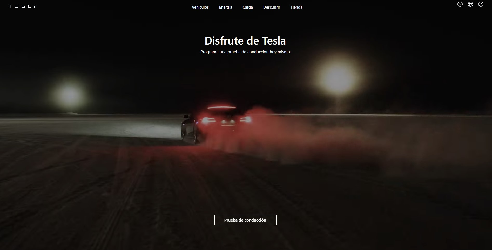

# 🚗 Réplica Landing de Tesla en Versión de Escritorio con Animaciones,Tailwind CSS & React

## Características Destacadas:
 -React en Acción ⚛️ Aproveché la potencia de React para dividir la interfaz en componentes reutilizables y modulares. 

-¡Arrancando con Tailwind! 💨 Me sumergí en las clases de estilo de Tailwind CSS para agilizar la creación de componentes y elementos de la página. ¡Las posibilidades de diseño fueron emocionantes de descubrir!

-  Incorporé animaciones✨suaves y atractivas utilizando la biblioteca animate.css. Estas animaciones añaden un toque de magia a la experiencia de navegación, captando la atención y brindando una sensación de interacción.

- Código Ordenado y Limpio 🧹 Mantuve una estructura organizada utilizando clases de Tailwind CSS de manera modular. Esto me permitió mantener mi código limpio y me dio flexibilidad para ajustar el estilo cuando fuera necesario.

- Explorando con Creatividad 🚀 ¡Este proyecto no solo se trataba de replicar, sino de explorar! Con Tailwind CSS y animaciones, tuve la oportunidad de plasmar mi visión única en la réplica de la página de inicio.

- Mi objetivo con este proyecto fue aprender y aplicar nuevas habilidades mientras daba vida a la página de inicio de Tesla en su versión de escritorio. Espero que disfrutes explorando mi interpretación y cómo Tailwind CSS y las animaciones dieron vida a este proyecto.

# Tecnologías Utilizadas
 ## Front-end
- HTML5
- React 
- TailwindCSS 

 
  
  

## Herramientas  Utilizadas
- Visual Studio Code
- Git y GitHub: para el control de versiones y plataforma en línea para almacenar, colaborar y gestionar tu proyecto de manera remota

 

# Instalación

1. Clonar el proyecto
2. git clone https://github.com/Alejandro9011/landingTeslaReact
3. Instalar las dependencias del front-end con el comando:

* npm install

### Para iniciar el cliente:
* npm start

¡Espero que te diviertas explorando mi interpretación de la versión de escritorio de la página de inicio de Tesla! Si tienes comentarios o sugerencias, ¡estaré encantado de   escucharlos! 🎉
